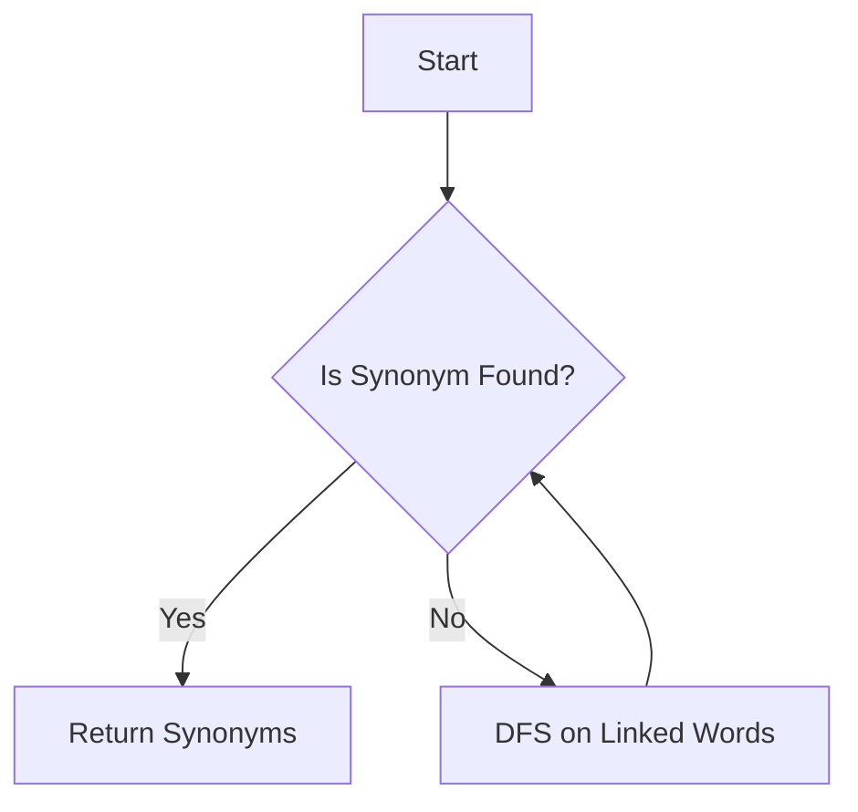

# **Synonym Search API**

This is the backend of the Synonym Search Tool, built using **Node.js**. The backend provides APIs to search for synonyms and add new synonyms. The application is designed to handle large datasets efficiently and is scalable.

#### [Live demo](https://synonym-search-api-5fb6ff9b4a59.herokuapp.com/)

#### [Frontend repo](https://github.com/samirsayyad/synonym-search-frontend)

## **Table of Contents**

- [Features](#features)
- [Technologies](#technologies)
- [Project Structure](#project-structure)
- [API Documentation](#api-documentation)
- [DFS Flow](#dfs-flow)
- [How to Deploy](#how-to-deploy)
- [Run Locally](#run-locally)

## **Features**

- Search for synonyms of a word.
- Add new synonyms for words.
- Error handling and validation.
- Used DFS for finding synonyms of a word

## **Technologies**

- **Node.js**
- **Express**
- **Jest** (for testing)
- **ESLint** (for linting)

## **Project Structure**

```bash
├── controllers
│   └── synonymController.js   # Contains logic for handling synonym operations
├── docs
│   └── swaggerOptions.js
├── middlewares
│   └── errorHandler.js      # middleware of error handling
│   └── validationMiddleware.js      # middleware for validation
├── routes
│   └── synonymRoutes.js       # API routes for synonym operations
├── services
│   └── synonymService.js      # Service layer handling synonym logic
├── tests
│   └── synonym.test.js            # Unit and integration tests for synonyms
├── utiles
│   └── logger # will log under log folder in local
├── index.js                     # Main application entry point
├── package.json                   # Node.js dependencies and scripts
└── README.md                      # Project documentation
```

## **API Documentation**

### **1. Find Synonym**

**POST** `/find-synonym`

- **Description:** Find synonyms for a given word.
- **Request:**
  - `word` (string) - The word to find synonyms for.
- **Response:**
  - `200 OK`: Returns a list of synonyms.
  - `400 Bad Request`: Invalid word or missing data.
- **Example:**

```json
{
  "word": "happy"
}
```

```json
{
  "synonyms": ["cheerful", "joyful", "content"]
}
```

### **2. Add Synonym**

**POST** `/add-synonym`

- **Description:** Add a new synonym for a word.
- **Request:**
  - `word` (string) - The word to add a synonym for.
  - `synonym` (string) - The synonym to add.
- **Response:**
  - `200 OK`: Synonym added successfully.
  - `400 Bad Request`: Invalid input or missing data.
- **Example:**

```json
{
  "word": "happy",
  "synonym": "joyous"
}
```

## **DFS Flow**

Below is a diagram that demonstrates the logic behind the synonym search tool's depth-first search (DFS) algorithm. This algorithm traverses the data structure efficiently to find related synonyms.



This shows the process flow for the recursive search in the synonym data structure.

## **How to Deploy**

### **Deploy to Heroku**

1. Ensure you have a **Heroku** account and **Heroku CLI** installed.
2. Login to your Heroku account:
   ```bash
   heroku login
   ```
3. Create a new Heroku app:
   ```bash
   heroku create
   ```
4. Push your code to Heroku:
   ```bash
   git push heroku main
   ```
5. Set environment variables for your MongoDB connection:
   ```bash
   heroku config:set APP_URL=<your_app_url>
   ```
6. Your app should be live and accessible via the Heroku URL.

## **Run Locally**

To run this project locally, follow these steps:

1. Clone the repository:
   ```bash
   git clone <repository_url>
   ```
2. Navigate into the project directory:
   ```bash
   cd synonym-search-backend
   ```
3. Install dependencies:
   ```bash
   npm install
   ```
4. Start the server:
   ```bash
   npm start
   ```
5. The backend will be running on `http://localhost:5000/`.
